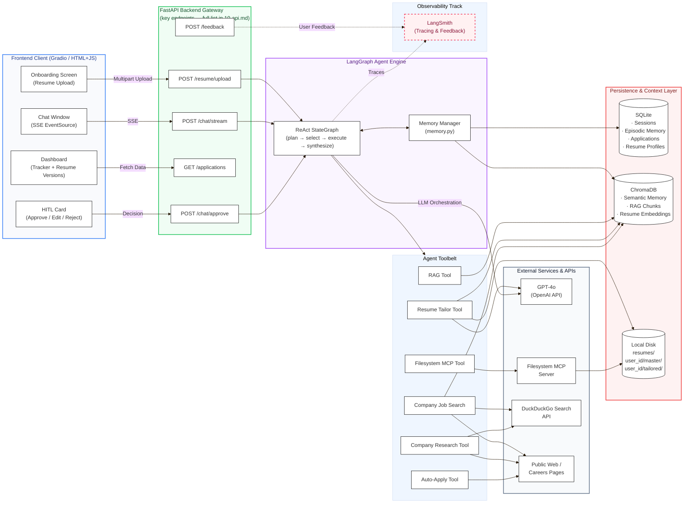

# System Overview

Full map of every component and how they connect. Read top-to-bottom: user actions flow through the frontend into the API, the agent picks tools, tools hit external services and databases, everything is traced to LangSmith.

## Architecture Diagram



## Layer Summary

| Layer | Components | Responsibility |
|-------|-----------|----------------|
| Frontend | Chat, Onboarding, Dashboard, HITL Card | User interaction, SSE rendering, HITL approval UI |
| FastAPI | 5 endpoint groups | REST + SSE gateway, request routing |
| LangGraph Agent | StateGraph, memory.py | ReAct reasoning loop, memory injection/storage |
| Agent Tools | 6 tools | Job search, resume tailoring, auto-apply, RAG, research, file I/O |
| Persistence | SQLite, ChromaDB | Structured data + vector embeddings |
| External | GPT-4o, DuckDuckGo, Web, MCP Server | LLM inference, web search, browser automation |
| Observability | LangSmith | End-to-end tracing, user feedback, evaluation datasets |

## Data Flow Summary

```
User message
  → POST /chat/stream
  → LangGraph: load memories → plan → tool_select → tool_execute (loop) → synthesize → respond
  → SSE token stream → browser
  → (if HITL needed) → pause → emit hitl_request → wait for POST /chat/approve → resume
  → post-turn: summarize → SQLite (episodic) + ChromaDB (semantic) + LangSmith (trace)
```
