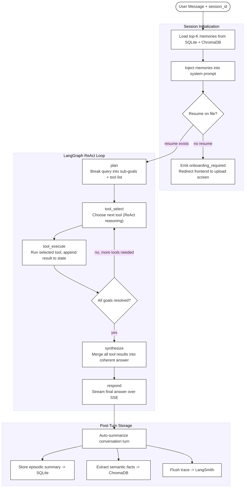

# Agent Orchestration

The LangGraph `StateGraph` is the core of the system. It runs on every user message, deciding which tools to invoke, managing memory, and handling HITL interrupts.

## ReAct Loop



## Node Responsibilities

| Node | Phase | Purpose |
|------|-------|---------|
| Load Memories | Init | Query SQLite for recent episodic summaries + ChromaDB for top-K semantic facts |
| Inject Memories | Init | Prepend retrieved context to the system prompt for this turn |
| Resume Guard | Init | Gate — blocks all features until a master resume is on file |
| plan | ReAct | GPT-4o breaks the user request into an ordered list of sub-goals and candidate tools |
| tool_select | ReAct | GPT-4o picks the next tool based on remaining sub-goals and prior tool outputs |
| tool_execute | ReAct | Runs the selected tool, appends raw output to the shared graph state |
| synthesize | ReAct | GPT-4o combines all tool results into a single coherent intermediate answer |
| respond | ReAct | Streams the final answer to the frontend token by token via SSE |
| Auto-summarize | Post | GPT-4o writes a short summary of the full turn |
| Store episodic | Post | Persists summary to `episodic_memories` table in SQLite |
| Extract facts | Post | GPT-4o extracts career facts ("5 yrs Python", "targets senior IC") → ChromaDB |
| Flush trace | Post | LangSmith run is finalized and closed |

## Available Tools

| Tool | File | Trigger |
|------|------|---------|
| RAG | `agent/tools/rag.py` | Questions about user's own career history or uploaded docs |
| Company Job Search | `agent/tools/company_job_search.py` | "Find jobs at Stripe in New York" |
| Resume Tailor | `agent/tools/resume_tailor.py` | "Tailor my resume for #3" / job URL |
| Company Research | `agent/tools/company_research.py` | "Tell me about Stripe's culture" |
| Auto-Apply | `agent/tools/auto_apply.py` | "Apply to #3" / direct job URL |
| Filesystem MCP | `agent/tools/mcp_fs.py` | Reading/writing resume files to disk |

## Onboarding Guard

If no resume is on file, any chat message immediately returns:

```json
{
  "type": "onboarding_required",
  "message": "Please upload your master resume to get started."
}
```

The frontend intercepts this event and redirects to the resume upload screen. No tool execution or LLM call happens until a resume exists.

## Graph State Shape

```python
class AgentState(TypedDict):
    session_id: str
    user_id: str
    messages: list[BaseMessage]      # full conversation history this turn
    memories: list[str]              # injected episodic + semantic context
    tool_results: list[ToolResult]   # accumulated tool outputs
    pending_goals: list[str]         # sub-goals not yet resolved
    hitl_pending: bool               # True when waiting for POST /chat/approve
    hitl_decision: str | None        # "approve" | "edit" | "reject"
```
