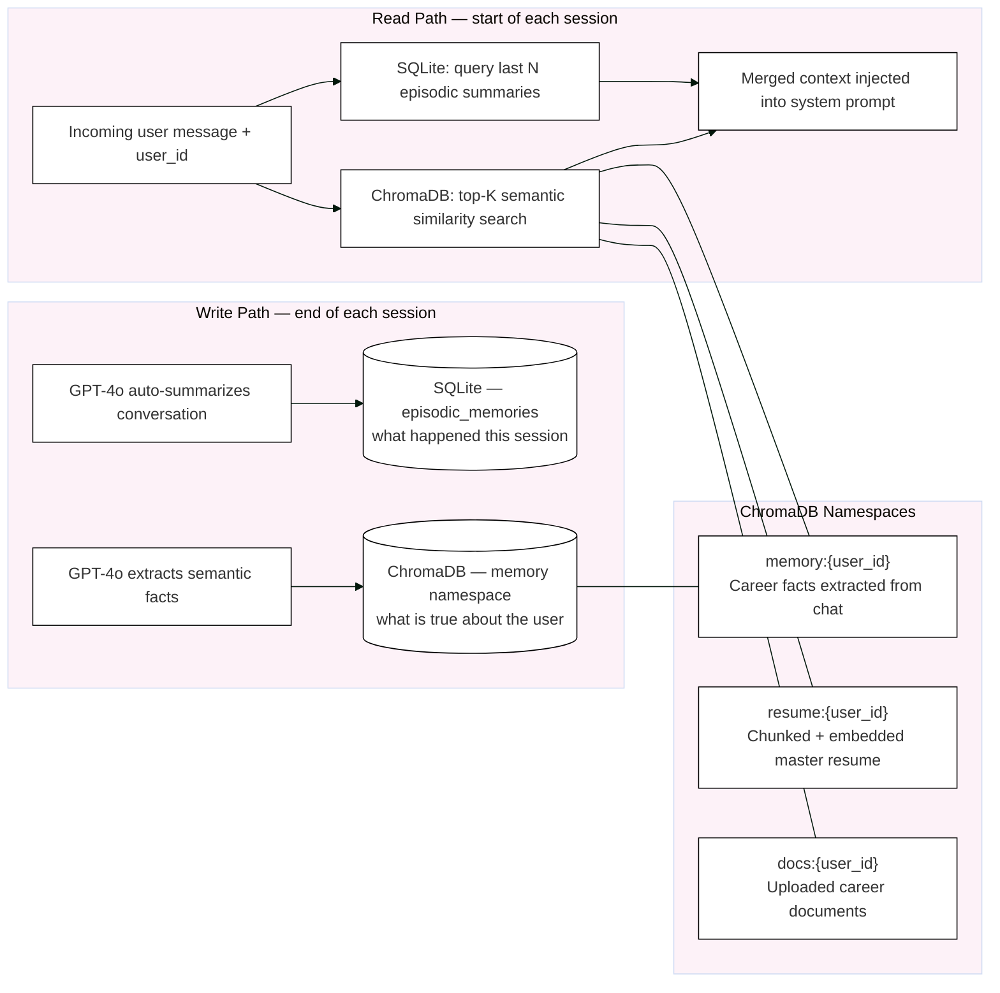
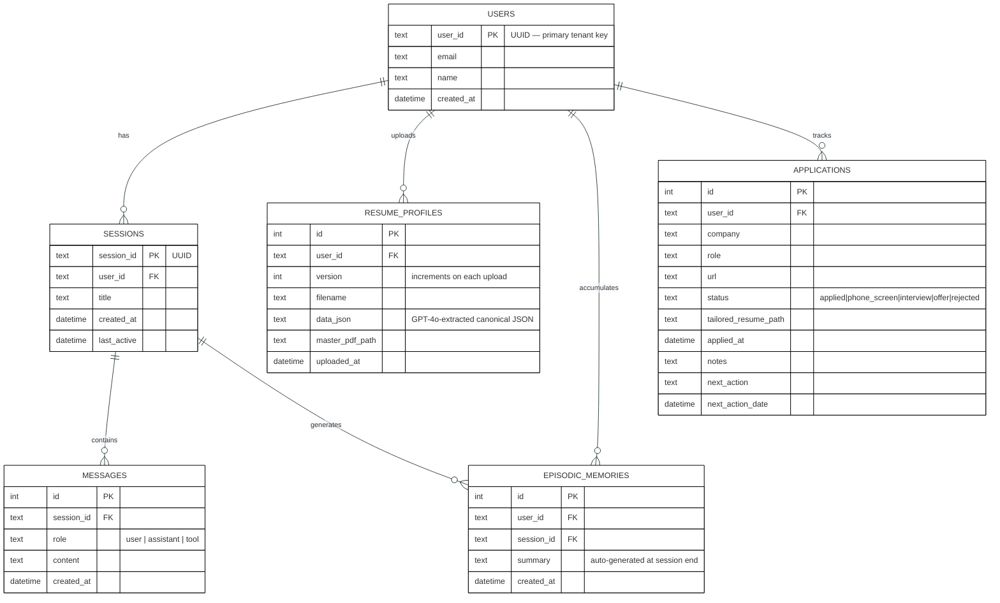

# Persistence

Two storage systems work together. SQLite captures structured, relational data (what happened). ChromaDB stores vector embeddings for semantic similarity search (what is true about the user).

## Two-Tier Memory

### Why Two Tiers?

| Tier | Store | What it holds | Query method |
|------|-------|---------------|--------------|
| Episodic | SQLite | "On 2025-06-10 user applied to Stripe, was rejected" | Row lookup by user_id, ordered by date |
| Semantic | ChromaDB | "User has 5 years Python", "Targets senior IC roles" | Cosine similarity against current message embedding |

Episodic memory gives the agent a timeline. Semantic memory gives it persistent facts that are relevant to whatever the user is asking right now.

---

## Database Schema

## SQLite Tables

| Table | Key Columns | Notes |
|-------|-------------|-------|
| `users` | `user_id` (PK) | Top-level tenant; all other tables FK here |
| `sessions` | `session_id`, `title`, `last_active` | One row per conversation; agent can list/resume/delete |
| `messages` | `role`, `content` | Full message history per session |
| `resume_profiles` | `version`, `data_json`, `master_pdf_path` | New row on every upload; old versions never deleted |
| `episodic_memories` | `summary`, `created_at` | Written at end of each session by auto-summarize node |
| `applications` | `status`, `tailored_resume_path`, `next_action_date` | Job tracker; status progresses through the enum |

## ChromaDB Collections

| Namespace | Content | Populated by |
|-----------|---------|--------------|
| `resume:{user_id}` | Master resume chunks (512 tok, 50 tok overlap) | Resume ingestion pipeline |
| `memory:{user_id}` | Career facts extracted by GPT-4o | Post-turn memory write, resume ingestion |
| `docs:{user_id}` | Uploaded career documents (cover letters, interview notes) | `POST /documents/upload` |

## Embedding Model

All ChromaDB collections use `sentence-transformers/all-MiniLM-L6-v2` — runs locally, no API key required.

## Implementation Files

| File | Responsibility |
|------|---------------|
| `db/sqlite.py` | All SQLite DDL + CRUD helpers |
| `db/chroma.py` | ChromaDB client wrapper — upsert, query, delete by namespace |
| `agent/memory.py` | Orchestrates read (session start) and write (session end) across both stores |
