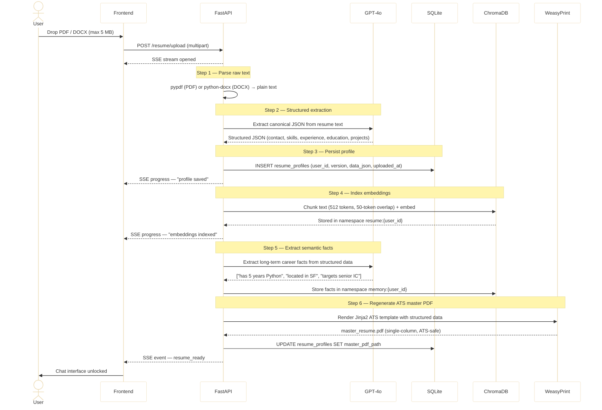

# Resume Ingestion Pipeline

Triggered by `POST /resume/upload`. Runs automatically after a PDF or DOCX is uploaded. Progress is streamed to the browser over SSE after each step. The chat interface is locked until this pipeline completes successfully.

## Sequence Diagram



## Extraction Schema

GPT-4o extracts the resume into this canonical JSON structure:

```json
{
  "contact": {
    "name": "",
    "email": "",
    "phone": "",
    "location": "",
    "linkedin": "",
    "github": ""
  },
  "summary": "",
  "skills": [""],
  "experience": [
    { "company": "", "title": "", "dates": "", "bullets": [""] }
  ],
  "education": [
    { "institution": "", "degree": "", "field": "", "year": "" }
  ],
  "certifications": [""],
  "projects": [
    { "name": "", "description": "", "tech_stack": [""] }
  ]
}
```

## Chunking Strategy

| Parameter | Value |
|-----------|-------|
| Chunk size | 512 tokens |
| Overlap | 50 tokens |
| Embedding model | `sentence-transformers/all-MiniLM-L6-v2` (local) |
| ChromaDB namespace | `resume:{user_id}` |

## Versioning

Each upload creates a new row in `resume_profiles` with an incremented `version` number. Previous versions are never deleted — they remain queryable via `GET /resume/versions`. The master PDF for each version is stored at:

```
resumes/{user_id}/master/master_resume_v{version}.pdf
```

## Onboarding Guard

Until step 6 completes, any chat message returns:

```json
{ "type": "onboarding_required", "message": "Please upload your master resume to get started." }
```

## API Endpoints

| Endpoint | Purpose |
|----------|---------|
| `POST /resume/upload` | Trigger the ingestion pipeline (multipart, field: `resume_file`) |
| `GET /resume/current` | Return the latest version's structured JSON + PDF path |
| `GET /resume/versions` | List all versions with metadata |
| `DELETE /resume/versions/{version_id}` | Soft-delete a specific version |

## Implementation Files

| File | Responsibility |
|------|---------------|
| `api/resume.py` | Upload endpoint, SSE progress events |
| `agent/resume/ingestion.py` | Parse → extract → chunk → embed pipeline |
| `agent/resume/pdf_generator.py` | Jinja2 render + WeasyPrint conversion |
| `agent/resume/templates/ats_resume.html` | ATS-safe single-column HTML template |
