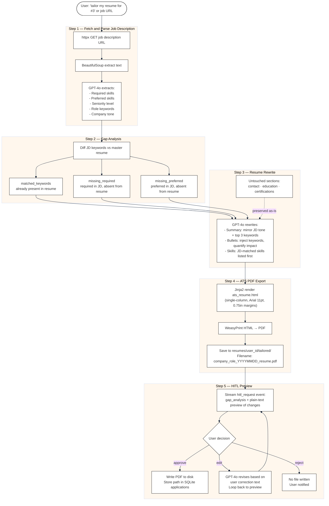

# Resume Tailoring Pipeline

Triggered when the user says "tailor my resume for #3" or provides a job URL directly. Produces an ATS-safe PDF customised for that specific job, gated by a HITL preview before writing to disk.

## Flow Diagram



## Gap Analysis Output

| List | Meaning | Action |
|------|---------|--------|
| `matched_keywords` | Keyword already in master resume | Reorder to appear earlier |
| `missing_required` | Required by JD, missing from resume | Add naturally to bullets/summary |
| `missing_preferred` | Preferred by JD, missing from resume | Add if it can be supported by experience |

## ATS PDF Specification

The Jinja2 template (`ats_resume.html`) enforces these constraints so the PDF passes ATS scanners:

| Property | Value |
|----------|-------|
| Layout | Single column — no tables, text boxes, or columns |
| Font | Arial or Helvetica |
| Body size | 11pt |
| Heading size | 14pt |
| Margins | 0.75 inch all sides |
| Text | All content in `<p>` / `<ul>` tags — fully selectable |
| Section order | Contact → Summary → Skills → Experience → Education → Certifications → Projects |
| Bullets | Plain hyphen (`-`) or Unicode bullet (`•`) |
| Excluded | Headers, footers, page numbers, graphics, columns, decorative borders |

## HITL Event Payload

```json
{
  "type": "hitl_request",
  "action": "write_resume",
  "details": {
    "gap_analysis": {
      "matched_keywords": ["Python", "FastAPI"],
      "missing_required": ["Kubernetes", "Terraform"],
      "missing_preferred": ["Go"]
    },
    "preview": "SUMMARY: Results-driven engineer with 5 years Python...\n\nTOP CHANGES:\n• Added 'Kubernetes' to infra bullet at Acme Corp\n..."
  }
}
```

## Output Storage

```
resumes/
  {user_id}/
    tailored/
      stripe_sre_20250615_resume.pdf
      google_ml_20250620_resume.pdf
```

The tailored PDF path is also stored in `applications.tailored_resume_path` so the Auto-Apply tool always uploads the correct version for that job.

## Implementation Files

| File | Responsibility |
|------|---------------|
| `agent/tools/resume_tailor.py` | Orchestrates all 5 steps, emits HITL event |
| `agent/resume/tailoring.py` | Gap analysis logic + GPT-4o bullet rewrite |
| `agent/resume/pdf_generator.py` | Jinja2 render + WeasyPrint conversion |
| `agent/resume/templates/ats_resume.html` | ATS-compliant HTML template |
