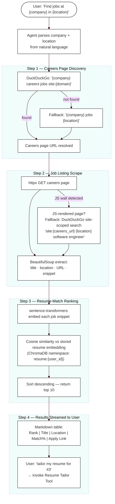

# Company Job Search Pipeline

Triggered when the user says something like "Find me jobs at Stripe in New York" or "Search Adobe for remote ML roles". The agent parses company and location from natural language, discovers the careers page, scrapes job listings, ranks them by resume match, and streams a markdown table back to the user.

## Flow Diagram



## Input / Output Schema

### Tool Input

```python
{
    "company_name": str,   # e.g. "Stripe"
    "location": str,       # e.g. "New York" or "remote"
    "max_results": int     # default 10
}
```

### Tool Output

```python
[
    {
        "rank": 1,
        "title": "Senior Software Engineer, Payments",
        "url": "https://stripe.com/jobs/listing/...",
        "location": "New York, NY",
        "snippet": "Work on Stripe's core payments infrastructure...",
        "match_score": 0.87
    },
    ...
]
```

## Ranking Algorithm

| Step | Detail |
|------|--------|
| Embedding model | `sentence-transformers/all-MiniLM-L6-v2` (local, free) |
| Resume vector | Retrieved from ChromaDB namespace `resume:{user_id}` |
| Job snippet vector | Embedded on the fly per listing |
| Similarity metric | Cosine similarity |
| Output | Top 10 sorted by score descending |

## Careers Page Discovery Strategy

1. Try DuckDuckGo: `{company} careers jobs site:{company_domain}`
2. If no result: fall back to `{company} jobs {location}`
3. If careers page is JS-rendered (httpx returns no job listings): fall back to DuckDuckGo site-scoped search: `site:{careers_url} {location} software engineer`

## Result Table Format

The agent streams this as a markdown table in the chat:

```
| Rank | Title                              | Location    | Match % | Apply |
|------|------------------------------------|-------------|---------|-------|
| 1    | Senior Software Engineer, Payments | New York    | 87%     | [Link](url) |
| 2    | Backend Engineer, Risk             | Remote      | 81%     | [Link](url) |
```

After seeing the table, the user can say:
- `"tailor my resume for #1"` → invokes Resume Tailor Tool
- `"apply to #2"` → invokes Auto-Apply Tool
- `"tell me more about Stripe"` → invokes Company Research Tool

## Implementation Files

| File | Responsibility |
|------|---------------|
| `agent/tools/company_job_search.py` | Full pipeline: discovery → scrape → rank → return |
| `db/chroma.py` | Resume embedding retrieval for cosine comparison |
