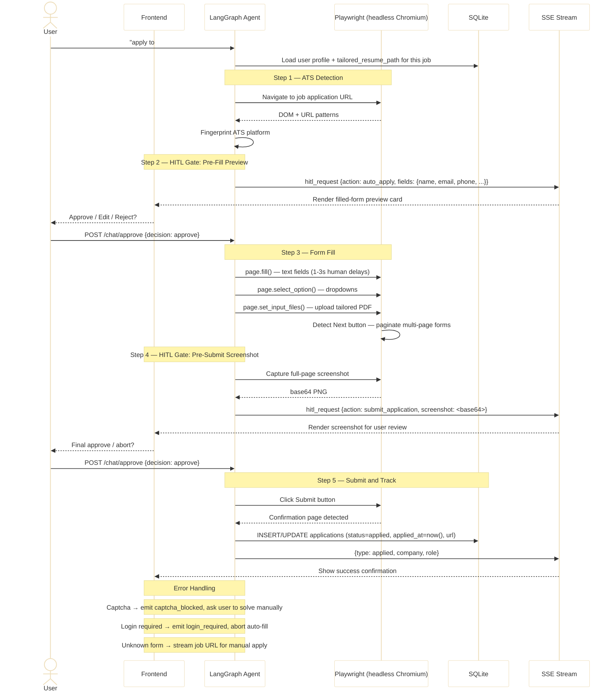

# Playwright Auto-Apply Pipeline

Triggered when the user says "apply to #3" or provides a direct job URL. Uses Playwright to detect the ATS platform, fill the application form, and submit — with two mandatory HITL approval gates before any form interaction and before final submission.

## Sequence Diagram



## ATS Platform Detection

The agent inspects the page URL and DOM to identify the platform:

| Platform | Detection Signature |
|----------|-------------------|
| Greenhouse | `greenhouse.io` or `boards.greenhouse.io` in URL |
| Lever | `jobs.lever.co` in URL |
| Workday | `myworkdayjobs.com` in URL |
| Taleo | `taleo.net` in URL |
| ICIMS | `icims.com` in URL |
| Generic | Fallback heuristic — inspect `<input>` labels |

Each platform has a dedicated field map in `agent/playwright/field_maps/` that maps profile fields to CSS selectors.

## Profile Data Mapping

Data loaded from SQLite for form filling:

```python
{
    "full_name":           str,   # from resume_profiles.data_json
    "email":               str,
    "phone":               str,
    "address":             str,
    "linkedin_url":        str,
    "github_url":          str,
    "years_experience":    int,
    "current_title":       str,
    "resume_pdf_path":     str    # tailored PDF if available, else master
}
```

## HITL Gate 1 — Pre-Fill Preview

Event emitted before Playwright touches the form:

```json
{
  "type": "hitl_request",
  "action": "auto_apply",
  "details": {
    "company": "Stripe",
    "role": "Senior Software Engineer",
    "ats_platform": "Greenhouse",
    "fields": {
      "First Name": "Jane",
      "Last Name": "Smith",
      "Email": "jane@example.com",
      "Phone": "+1-555-000-0000",
      "LinkedIn": "https://linkedin.com/in/janesmith",
      "Resume": "stripe_sre_20250615_resume.pdf"
    }
  }
}
```

## HITL Gate 2 — Pre-Submit Screenshot

Event emitted after all fields are filled, before clicking Submit:

```json
{
  "type": "hitl_request",
  "action": "submit_application",
  "screenshot": "<base64-encoded PNG of full application page>"
}
```

## Error Events

| Event | Cause | Resolution |
|-------|-------|-----------|
| `captcha_blocked` | CAPTCHA detected | User solves manually; agent waits |
| `login_required` | ATS requires account login | Agent streams URL; user applies manually |
| `unknown_form` | No field map matches | Agent streams job URL for manual apply |

## Human-Like Behaviour

To reduce bot detection, Playwright adds a random 1–3 second delay between each field interaction. The `playwright-stealth` plugin is also applied to suppress common automation fingerprints.

## Application Tracker Update

On successful submission, the agent writes to SQLite:

```sql
INSERT INTO applications (user_id, company, role, url, status, applied_at, tailored_resume_path)
VALUES (?, ?, ?, ?, 'applied', datetime('now'), ?);
```

## Implementation Files

| File | Responsibility |
|------|---------------|
| `agent/tools/auto_apply.py` | Pipeline orchestration, HITL events, SSE streaming |
| `agent/playwright/ats_detector.py` | URL + DOM fingerprinting |
| `agent/playwright/form_filler.py` | Field mapping and Playwright fill logic |
| `agent/playwright/field_maps/greenhouse.py` | Greenhouse CSS selectors |
| `agent/playwright/field_maps/lever.py` | Lever CSS selectors |
| `agent/playwright/field_maps/workday.py` | Workday CSS selectors |
| `agent/playwright/field_maps/generic.py` | Heuristic fallback selectors |
