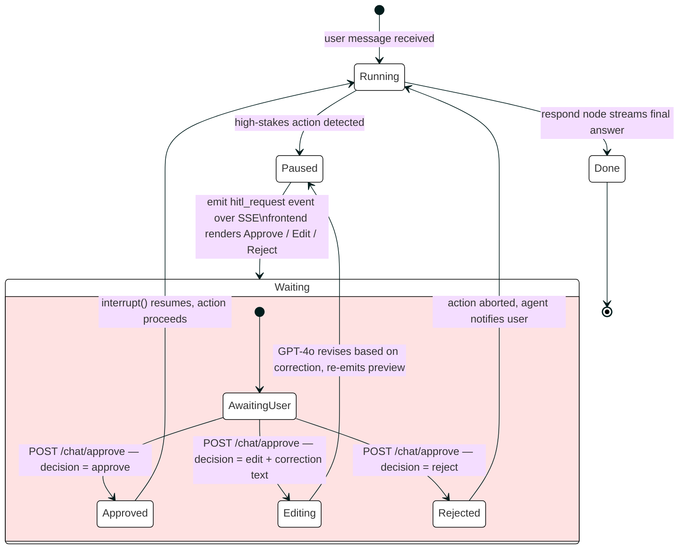

# Human-in-the-Loop (HITL)

The agent pauses before any high-stakes, irreversible action and waits for explicit user approval. The mechanism is a LangGraph `interrupt()` node that suspends graph execution until the frontend posts a decision to `POST /chat/approve`.

## State Machine



## HITL Gates

| Gate | Action | What the user reviews |
|------|--------|-----------------------|
| `write_resume` | Before writing tailored PDF to disk | Gap analysis + plain-text preview of rewritten summary and top 3 bullet changes |
| `auto_apply` | Before Playwright touches any form field | Table of all fields that will be filled (name, email, phone, resume file) |
| `submit_application` | Before clicking Submit | Full-page screenshot of the completed application form |
| `send_followup` *(planned)* | Before sending a follow-up email | Draft email text |

## SSE Event Format

When the agent hits a HITL gate it emits one event and suspends:

```json
{
  "type": "hitl_request",
  "action": "write_resume | auto_apply | submit_application | send_followup",
  "details": { ... }
}
```

The frontend must render an approval UI and POST back:

```json
{
  "decision": "approve | edit | reject",
  "correction": "optional free-text if decision is edit"
}
```

## Resume Preview Event (write_resume)

```json
{
  "type": "hitl_request",
  "action": "write_resume",
  "details": {
    "gap_analysis": {
      "matched_keywords": ["Python", "FastAPI", "PostgreSQL"],
      "missing_required": ["Kubernetes", "Terraform"],
      "missing_preferred": ["Go"]
    },
    "preview": "SUMMARY: Results-driven engineer...\n\nCHANGED BULLETS:\n• [Acme Corp] Added 'Kubernetes' to infra bullet\n..."
  }
}
```

## Form Fill Preview Event (auto_apply)

```json
{
  "type": "hitl_request",
  "action": "auto_apply",
  "details": {
    "company": "Stripe",
    "role": "Senior Software Engineer",
    "ats_platform": "Greenhouse",
    "fields": {
      "First Name": "Jane",
      "Last Name": "Smith",
      "Email": "jane@example.com",
      "Phone": "+1-555-000-0000",
      "LinkedIn": "https://linkedin.com/in/janesmith",
      "Resume": "stripe_sre_20250615_resume.pdf"
    }
  }
}
```

## Screenshot Preview Event (submit_application)

```json
{
  "type": "hitl_request",
  "action": "submit_application",
  "screenshot": "<base64-encoded PNG>"
}
```

## Implementation

The HITL pattern is implemented using LangGraph's built-in `interrupt()`:

```python
# In the tool_execute node
if action_requires_hitl(action):
    interrupt({
        "type": "hitl_request",
        "action": action,
        "details": preview_payload
    })
    # Execution suspends here until POST /chat/approve

# Resume point — graph continues with the decision in state
decision = state["hitl_decision"]
if decision == "approve":
    perform_action()
elif decision == "edit":
    revise_and_re_preview(state["hitl_correction"])
else:
    abort_action()
```

The `POST /chat/approve` endpoint injects the decision into the suspended graph state and calls `graph.resume()`.

## Files

| File | Responsibility |
|------|---------------|
| `agent/graph.py` | `interrupt()` calls in tool_execute node |
| `api/chat.py` | `POST /chat/approve` — resumes suspended graph with decision |
