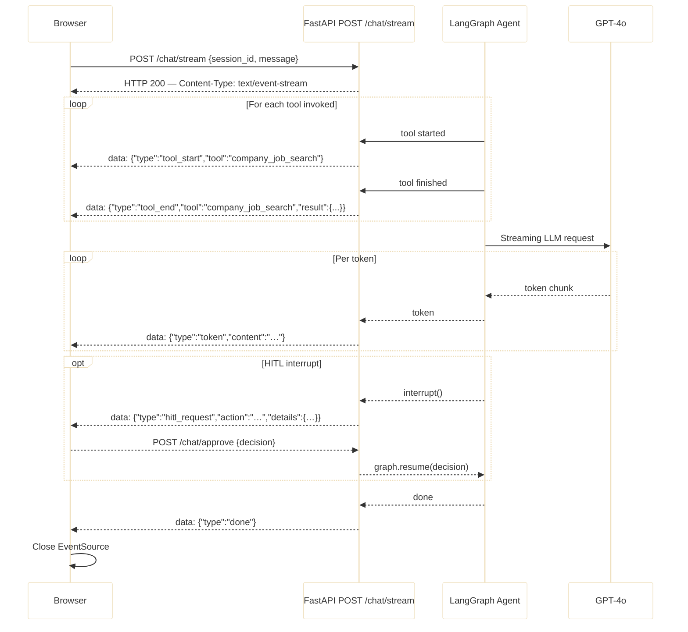

# Streaming Chat (SSE)

The backend streams responses token-by-token using Server-Sent Events (SSE). The browser opens a single long-lived HTTP connection and receives a mix of token chunks, tool lifecycle events, and HITL interrupts — all over the same stream.

## Sequence Diagram



## Event Types

| Event type | When emitted | Payload |
|------------|-------------|---------|
| `tool_start` | Tool node begins executing | `{ type, tool }` |
| `tool_end` | Tool node finishes | `{ type, tool, result }` |
| `token` | Each streamed token from GPT-4o | `{ type, content }` |
| `progress` | Long-running step milestone (e.g. resume ingestion) | `{ type, step }` |
| `hitl_request` | Agent pauses for user approval | `{ type, action, details }` |
| `applied` | Application submitted successfully | `{ type, company, role }` |
| `resume_ready` | Resume ingestion pipeline complete | `{ type, path }` |
| `onboarding_required` | No resume on file | `{ type, message }` |
| `captcha_blocked` | CAPTCHA encountered during auto-apply | `{ type }` |
| `login_required` | ATS requires account login | `{ type, url }` |
| `done` | All processing complete | `{ type }` |

## SSE Wire Format

Each event is a plain text line prefixed with `data: ` followed by a newline pair:

```
data: {"type":"tool_start","tool":"company_job_search"}

data: {"type":"token","content":"Here"}

data: {"type":"token","content":" are"}

data: {"type":"done"}

```

## Frontend EventSource Pattern

```javascript
// Native EventSource is GET-only. POST requires @microsoft/fetch-event-source:
// import { fetchEventSource } from '@microsoft/fetch-event-source';
const source = new EventSource('/chat/stream', { method: 'POST', body: JSON.stringify(payload) });

source.onmessage = (event) => {
  const msg = JSON.parse(event.data);
  switch (msg.type) {
    case 'token':        appendToken(msg.content); break;
    case 'tool_start':   showToolBadge(msg.tool);   break;
    case 'tool_end':     hideToolBadge(msg.tool);   break;
    case 'hitl_request': showHITLCard(msg);          break;
    case 'done':         source.close();             break;
  }
};
```

## Backend Endpoint

```python
# api/chat.py
@app.post("/chat/stream")
async def chat_stream(request: ChatRequest):
    return EventSourceResponse(agent_stream_generator(request))

async def agent_stream_generator(request):
    async for event in graph.astream(state, stream_mode="events"):
        yield f"data: {json.dumps(event)}\n\n"
```

## HITL Interrupt in the Stream

When the agent hits an `interrupt()` node, the SSE stream pauses. The browser renders the HITL approval card. After the user posts to `POST /chat/approve`, the graph resumes and the SSE stream continues from where it left off — there is no reconnection.

## Tool Progress Visibility

Every tool call surfaces two events so the user always knows what the agent is doing:

```
data: {"type":"tool_start","tool":"resume_tailor"}
... (tailoring happens) ...
data: {"type":"tool_end","tool":"resume_tailor","result":{"pdf_path":"..."}}
```

## Implementation Files

| File | Responsibility |
|------|---------------|
| `api/chat.py` | SSE endpoint, `EventSourceResponse`, stream generator |
| `agent/graph.py` | `astream()` call with `stream_mode="events"` |
