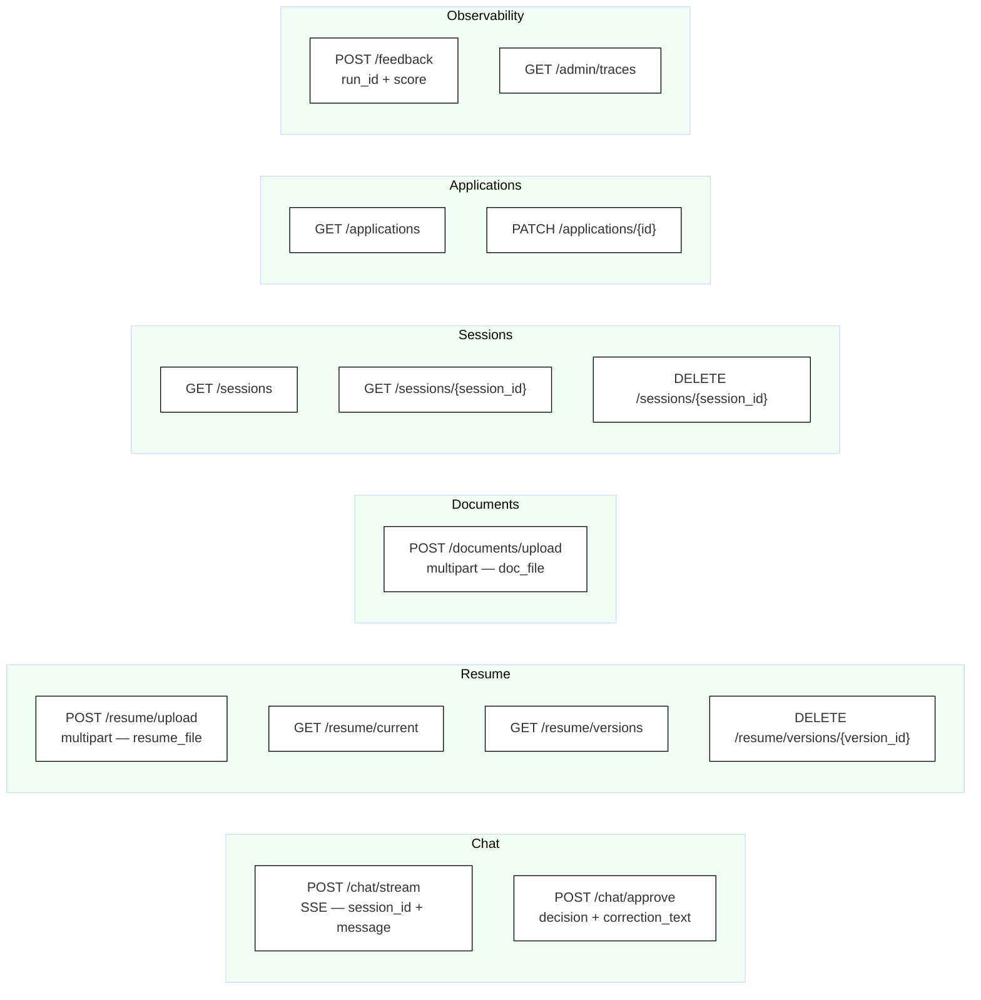

# API Surface

All REST and SSE endpoints exposed by the FastAPI backend. Grouped by domain.

## Endpoint Map



## Full Endpoint Reference

### Chat

| Method | Path | Description | Auth |
|--------|------|-------------|------|
| `POST` | `/chat/stream` | Start a streaming chat turn. Returns `text/event-stream`. | user |
| `POST` | `/chat/approve` | Resume a HITL-paused graph with user's decision. | user |

**`POST /chat/stream` body:**
```json
{
  "session_id": "uuid",
  "message": "Find me jobs at Stripe in NYC"
}
```

**`POST /chat/approve` body:**
```json
{
  "session_id": "uuid",
  "decision": "approve | edit | reject",
  "correction": "optional free-text for edit decisions"
}
```

---

### Resume

| Method | Path | Description |
|--------|------|-------------|
| `POST` | `/resume/upload` | Upload PDF or DOCX. Triggers full ingestion pipeline. Streams progress via SSE. |
| `GET` | `/resume/current` | Return the latest version's structured JSON and master PDF path. |
| `GET` | `/resume/versions` | List all uploaded versions with metadata. |
| `DELETE` | `/resume/versions/{version_id}` | Soft-delete a specific version (master PDF retained on disk). |

**`POST /resume/upload` form fields:**

| Field | Type | Notes |
|-------|------|-------|
| `resume_file` | file | PDF or DOCX, max 5 MB |
| `user_id` | string | UUID |

**`GET /resume/versions` response:**
```json
[
  {
    "id": 3,
    "version": 3,
    "filename": "jane_resume_v3.pdf",
    "uploaded_at": "2025-06-15T10:00:00Z",
    "master_pdf_path": "resumes/user123/master/master_resume_v3.pdf"
  }
]
```

---

### Documents

| Method | Path | Description |
|--------|------|-------------|
| `POST` | `/documents/upload` | Upload supporting career documents (cover letters, interview notes). Chunks and indexes into ChromaDB namespace `docs:{user_id}`. |

Supported types: PDF, plain text, Markdown.

---

### Sessions

| Method | Path | Description |
|--------|------|-------------|
| `GET` | `/sessions` | List all sessions for the user, ordered by `last_active` desc. |
| `GET` | `/sessions/{session_id}` | Get a single session with full message history. |
| `DELETE` | `/sessions/{session_id}` | Delete a session and its messages. |

---

### Applications

| Method | Path | Description |
|--------|------|-------------|
| `GET` | `/applications` | List applications. Supports query params: `?status=interview`, `?company=Stripe`. |
| `PATCH` | `/applications/{id}` | Update status, notes, next_action, or next_action_date. |

**`GET /applications` response:**
```json
[
  {
    "id": 42,
    "company": "Stripe",
    "role": "Senior SWE",
    "url": "https://stripe.com/jobs/...",
    "status": "interview",
    "applied_at": "2025-06-10T14:00:00Z",
    "next_action": "Technical interview",
    "next_action_date": "2025-06-20T10:00:00Z"
  }
]
```

---

### Observability

| Method | Path | Description |
|--------|------|-------------|
| `POST` | `/feedback` | Record thumbs-up/down for a run. Proxied to LangSmith `create_feedback`. |
| `GET` | `/admin/traces` | Proxy to LangSmith run list. For debugging agent behaviour. |

**`POST /feedback` body:**
```json
{
  "run_id": "langsmith-run-uuid",
  "score": 1
}
```

## Implementation Files

| File | Endpoints |
|------|----------|
| `api/chat.py` | `/chat/stream`, `/chat/approve` |
| `api/resume.py` | `/resume/*` |
| `api/documents.py` | `/documents/upload` |
| `api/sessions.py` | `/sessions/*` |
| `api/applications.py` | `/applications/*` |
| `observability/langsmith.py` | `/feedback`, `/admin/traces` |
