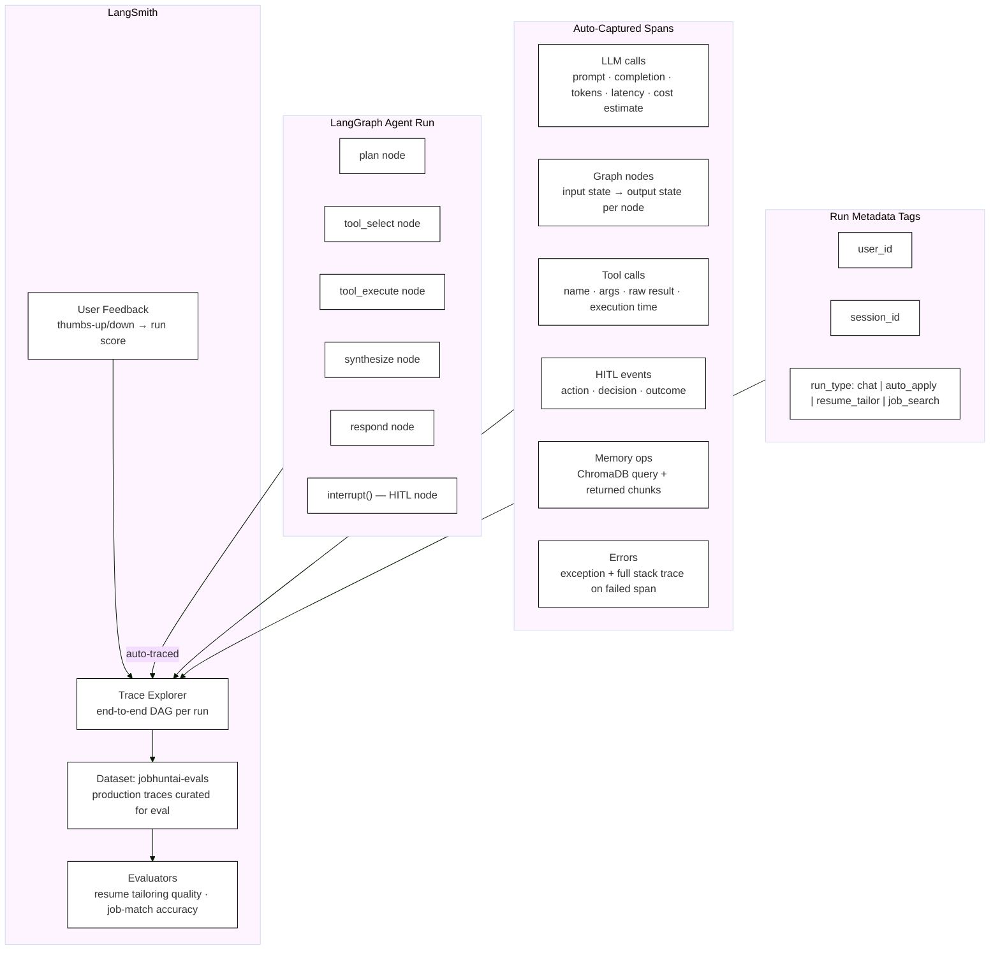

# Observability

Every agent run is traced end-to-end in LangSmith automatically via the LangChain/LangGraph integration. No manual instrumentation is needed beyond setting three environment variables.

## Tracing Architecture



## Environment Configuration

Add to `.env` (never commit this file):

```env
LANGCHAIN_TRACING_V2=true
LANGCHAIN_API_KEY=<your_langsmith_key>
LANGCHAIN_PROJECT=jobhuntai
LANGCHAIN_ENDPOINT=https://api.smith.langchain.com
```

With `LANGCHAIN_TRACING_V2=true` set, every `graph.invoke()` and `graph.astream()` call is automatically traced — no code changes required.

## What Each Span Captures

| Span type | Fields captured |
|-----------|----------------|
| LLM call | `prompt`, `completion`, `model`, `input_tokens`, `output_tokens`, `latency_ms`, `cost_usd` |
| Graph node | `node_name`, `input_state`, `output_state`, `latency_ms` |
| Tool call | `tool_name`, `input_args`, `raw_output`, `execution_time_ms` |
| HITL event | `action`, `decision` (`approve/edit/reject`), `correction_text` |
| Memory op | `query`, `namespace`, `top_k_chunks`, `similarity_scores` |
| Error | `exception_type`, `message`, `stack_trace`, attached to the failed span |

## Run Metadata

Every run is tagged with:

```python
# observability/langsmith.py
client.create_run(
    ...
    extra={
        "user_id":   state["user_id"],
        "session_id": state["session_id"],
        "run_type":  "chat | auto_apply | resume_tailor | job_search"
    }
)
```

This lets you filter traces in LangSmith by user, session, or workflow type.

## User Feedback

After each response, the frontend shows thumbs-up / thumbs-down. The vote is sent to `POST /feedback` and recorded in LangSmith:

```python
# observability/langsmith.py
def record_feedback(run_id: str, score: int):  # score: 1 = thumbs up, 0 = thumbs down
    client.create_feedback(run_id=run_id, key="user_rating", score=score)
```

## Dataset and Evaluation

1. Production traces are promoted to the `jobhuntai-evals` dataset in LangSmith.
2. Two evaluators run periodically:
   - **Resume tailoring quality** — does the rewritten resume actually mirror JD keywords?
   - **Job-match ranking accuracy** — do higher match scores correlate with applications the user chose to pursue?

## Debugging

`GET /admin/traces` proxies to the LangSmith run list API, giving a lightweight way to inspect recent runs without leaving the application:

```python
# observability/langsmith.py
@app.get("/admin/traces")
async def list_traces(limit: int = 20):
    return client.list_runs(project_name="jobhuntai", limit=limit)
```

## Implementation Files

| File | Responsibility |
|------|---------------|
| `observability/langsmith.py` | Client init, metadata tagging, feedback helper, trace proxy |
| `.env.example` | Template with required env var names (actual values gitignored) |
