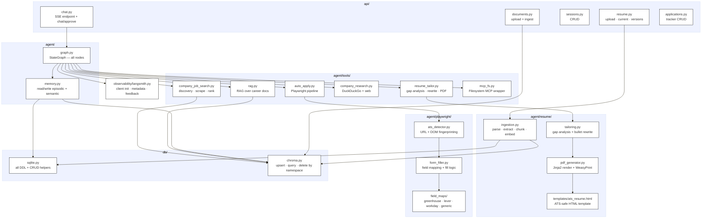

# Module Dependency Map

Shows which Python modules own which responsibilities and how they depend on each other. Arrows mean "imports / calls".

## Dependency Graph



## Module Responsibilities

### `api/`

| Module | Owns |
|--------|------|
| `chat.py` | `POST /chat/stream` SSE endpoint, `POST /chat/approve` HITL resume |
| `resume.py` | `POST /resume/upload`, `GET /resume/current`, `GET /resume/versions`, `DELETE /resume/versions/{id}` |
| `sessions.py` | Session list, get, delete |
| `documents.py` | `POST /documents/upload` — triggers RAG indexing |
| `applications.py` | Application tracker CRUD, `GET /applications`, `PATCH /applications/{id}` |

### `agent/`

| Module | Owns |
|--------|------|
| `graph.py` | Full LangGraph `StateGraph` definition — all nodes, edges, interrupt points |
| `memory.py` | Session-start memory retrieval (SQLite + ChromaDB); session-end summarize + store |

### `agent/tools/`

| Module | Tool | External deps |
|--------|------|--------------|
| `rag.py` | RAG over career docs | ChromaDB |
| `company_job_search.py` | Job search + ranking | DuckDuckGo, httpx, BeautifulSoup, sentence-transformers, ChromaDB |
| `resume_tailor.py` | JD gap analysis + rewrite + PDF | OpenAI API, `agent/resume/` modules |
| `company_research.py` | Company news + Glassdoor | DuckDuckGo, httpx |
| `auto_apply.py` | Playwright auto-apply | `agent/playwright/` modules |
| `mcp_fs.py` | File read/write | Filesystem MCP server |

### `agent/resume/`

| Module | Owns |
|--------|------|
| `ingestion.py` | pypdf/python-docx parse → GPT-4o structured extraction → chunk + embed → SQLite + ChromaDB |
| `tailoring.py` | Gap analysis (`matched/missing_required/missing_preferred`) + GPT-4o bullet rewrite |
| `pdf_generator.py` | Jinja2 template render + WeasyPrint HTML→PDF conversion |
| `templates/ats_resume.html` | ATS-compliant single-column HTML template |

### `agent/playwright/`

| Module | Owns |
|--------|------|
| `ats_detector.py` | URL pattern + DOM inspection to identify ATS platform |
| `form_filler.py` | Load platform field map, call `page.fill()` / `page.set_input_files()` |
| `field_maps/greenhouse.py` | Greenhouse CSS selector definitions |
| `field_maps/lever.py` | Lever CSS selector definitions |
| `field_maps/workday.py` | Workday CSS selector definitions |
| `field_maps/generic.py` | Heuristic fallback selectors |

### `db/`

| Module | Owns |
|--------|------|
| `sqlite.py` | All SQLite DDL, migrations, and CRUD for every table |
| `chroma.py` | ChromaDB client wrapper — upsert documents, similarity query, delete by namespace |

### `observability/`

| Module | Owns |
|--------|------|
| `langsmith.py` | LangSmith client init, run metadata tagging, feedback helper, trace proxy for `/admin/traces` |

## Project Directory Layout

```
job-hunt-agent/
├── agent/
│   ├── graph.py
│   ├── memory.py
│   ├── tools/
│   │   ├── rag.py
│   │   ├── company_job_search.py
│   │   ├── resume_tailor.py
│   │   ├── company_research.py
│   │   ├── auto_apply.py
│   │   └── mcp_fs.py
│   ├── resume/
│   │   ├── ingestion.py
│   │   ├── tailoring.py
│   │   ├── pdf_generator.py
│   │   └── templates/
│   │       └── ats_resume.html
│   └── playwright/
│       ├── ats_detector.py
│       ├── form_filler.py
│       └── field_maps/
│           ├── greenhouse.py
│           ├── lever.py
│           ├── workday.py
│           └── generic.py
├── api/
│   ├── chat.py
│   ├── resume.py
│   ├── sessions.py
│   ├── documents.py
│   └── applications.py
├── db/
│   ├── sqlite.py
│   └── chroma.py
├── observability/
│   └── langsmith.py
├── resumes/
│   └── {user_id}/
│       ├── master/
│       └── tailored/
├── frontend/
│   ├── app.py
│   ├── onboarding.py
│   └── dashboard.py
└── .env.example
```
