# JobHuntAI Architecture

## Overview

JobHuntAI is an AI-powered job search assistant that helps users:

* Upload and manage resumes
* Find matching jobs
* Tailor resumes for each job
* Apply automatically
* Track applications

The system is built around a LangGraph agent that uses tools, persistent memory, and human approval before performing important actions.

---

## User Flow

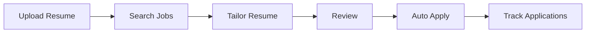

---

## High-Level Architecture

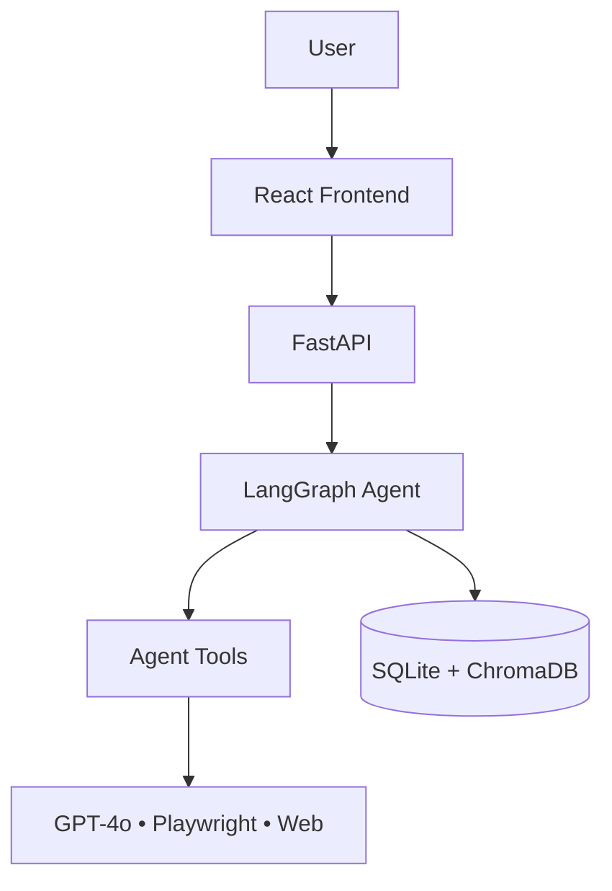

---

## Core Components

| Component  | Purpose                         |
| ---------- | ------------------------------- |
| Frontend   | User interface                  |
| FastAPI    | REST APIs & SSE                 |
| LangGraph  | Workflow orchestration          |
| Tools      | Resume, Search, Apply, Research |
| SQLite     | Application data                |
| ChromaDB   | Vector search & memory          |
| GPT-4o     | AI reasoning                    |
| Playwright | Browser automation              |

---

## Design Principles

* **Agent First** – One agent handles all workflows.
* **Tool Based** – Features are implemented as reusable tools.
* **Memory Aware** – Resume and conversations are remembered.
* **Human in the Loop** – Approval before important actions.
* **Streaming** – Progress and responses stream in real time.

# 2. Request Lifecycle

Every user request follows the same flow.

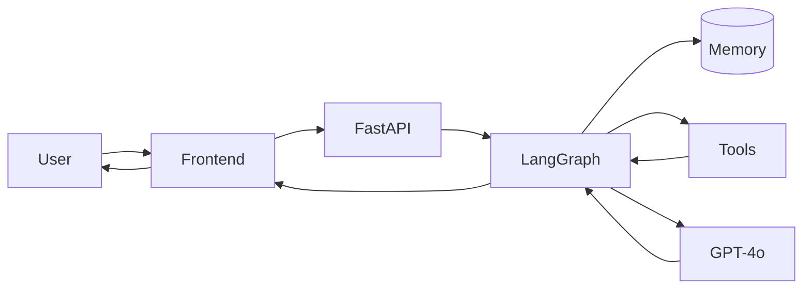

---

## Flow

### 1. User Request

The user sends a message from the frontend.

Examples:

* Find backend jobs at Stripe
* Tailor my resume for job #3
* Apply to job #2

---

### 2. Load Context

The agent loads:

* Resume
* Previous conversations
* User preferences
* Application history

---

### 3. Plan

The agent decides:

* Does this require tools?
* Which tools should run?
* Is user approval needed?

---

### 4. Execute Tools

Examples:

* Search jobs
* Read resume
* Research company
* Tailor resume
* Auto apply

Multiple tools can run in one request.

---

### 5. Generate Response

GPT-4o combines:

* User request
* Memory
* Tool results

into a final response.

---

### 6. Stream Response

The frontend receives updates in real time.

Examples:

* Token stream
* Tool started
* Tool finished
* Progress updates
* Approval requests
* Completion event

---

## Request Flow

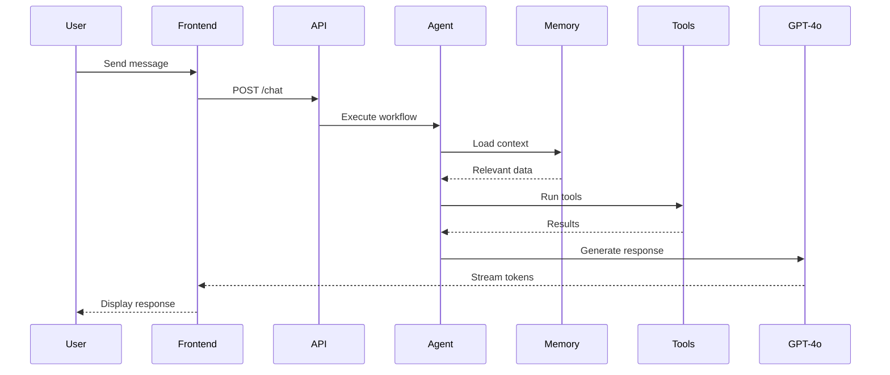
# 3. Agent Orchestration

LangGraph is the core of the system.

It manages planning, tool execution, memory, and user approvals.

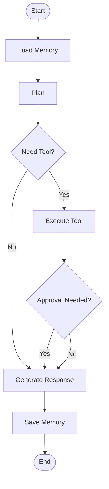

---

## Responsibilities

| Node         | Purpose                     |
| ------------ | --------------------------- |
| Load Memory  | Retrieve user context       |
| Plan         | Decide next action          |
| Execute Tool | Run external capability     |
| Approval     | Pause for user confirmation |
| Respond      | Generate final answer       |
| Save Memory  | Store conversation summary  |

---

## Available Tools

* Resume Retrieval
* Resume Tailoring
* Job Search
* Company Research
* Auto Apply
* File Storage

The planner chooses the required tools automatically.

# 4. Memory Architecture

The agent remembers information across conversations.

Two storage systems are used.

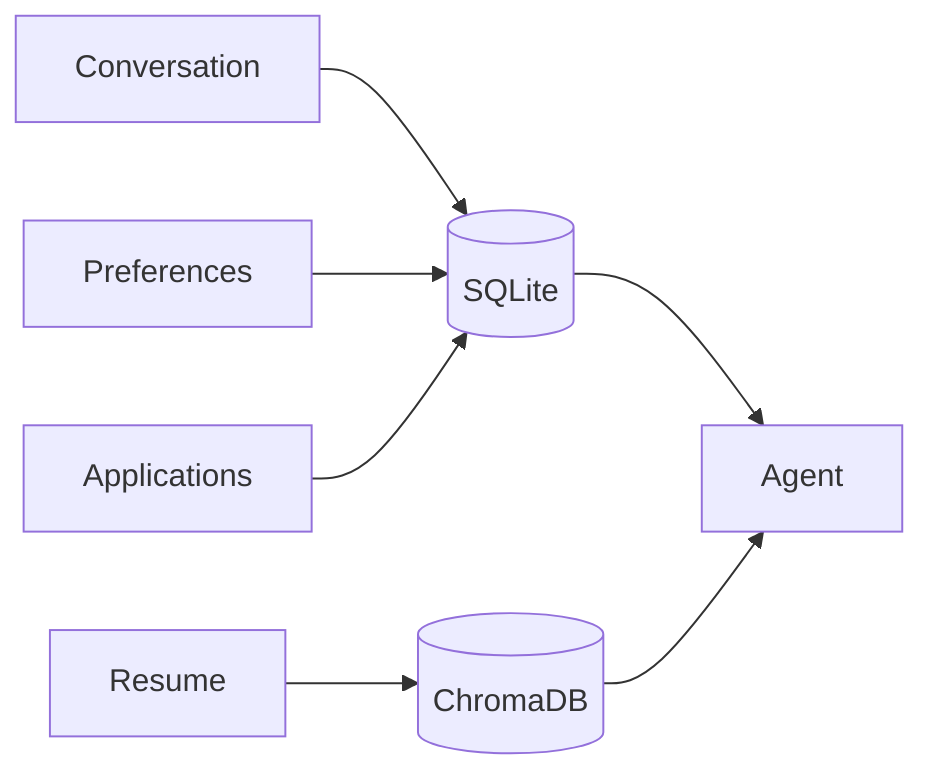

---

## SQLite

Stores structured application data.

* Sessions
* Messages
* Applications
* Resume metadata

---

## ChromaDB

Stores embeddings for semantic search.

* Resume chunks
* Career facts
* User documents

---

## Memory Flow

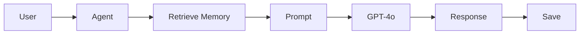
# 5. Resume Lifecycle

The resume is the foundation of the system.

After upload, it is parsed, indexed, and reused for every workflow.

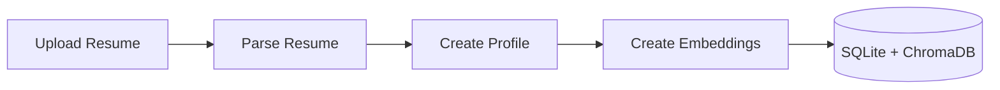

## Steps

1. Upload PDF or DOCX
2. Extract resume content
3. Build structured profile
4. Generate embeddings
5. Save for future use

The stored profile is used for job matching, resume tailoring, and applications.

# 6. Job Search Workflow

The agent searches company career pages and ranks jobs based on the user's resume.

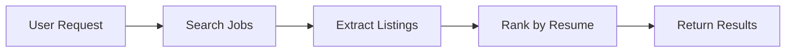

## Steps

1. Understand search request
2. Search company websites
3. Extract job postings
4. Compare against resume
5. Return ranked jobs

Each result includes:

* Company
* Role
* Location
* Match Score
* Apply Link

# 7. Resume Tailoring

The agent creates a resume optimized for a specific job.

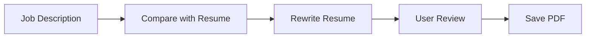

## Steps

1. Read job description
2. Identify missing keywords
3. Rewrite summary and experience
4. Generate ATS-friendly PDF
5. Wait for user approval
6. Save tailored resume

The original resume is never modified.

# 8. Auto Apply Workflow

The agent fills out job applications using Playwright.

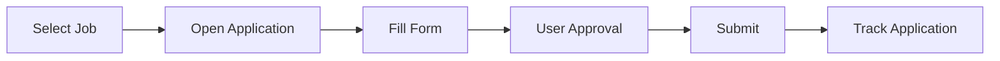

## Steps

1. Open application page
2. Detect ATS platform
3. Fill form fields
4. Upload tailored resume
5. Wait for approval
6. Submit application
7. Save application status

Applications are never submitted without user approval.

# 9. Human-in-the-Loop (HITL)

Some actions require user approval before continuing.

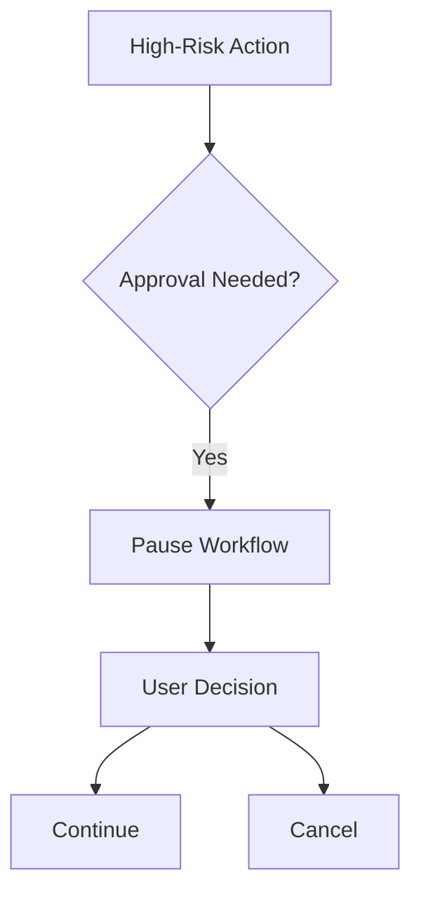

## Approval Required For

* Saving a tailored resume
* Submitting an application
* Sending follow-up emails
* Any future high-risk action

The workflow pauses until the user approves or rejects the action.
# 10. API Architecture

The frontend communicates with the backend using REST APIs and Server-Sent Events (SSE).

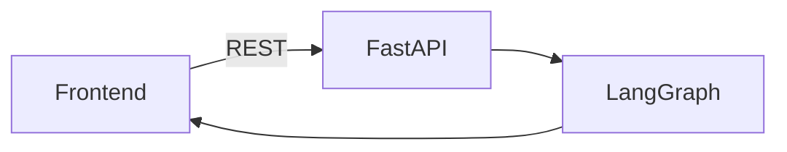

## Main Endpoints

| Endpoint                   | Purpose                     |
| -------------------------- | --------------------------- |
| `POST /chat/stream`        | Chat with AI (SSE)          |
| `POST /chat/approve`       | Resume interrupted workflow |
| `POST /resume/upload`      | Upload resume               |
| `GET /applications`        | List applications           |
| `PATCH /applications/{id}` | Update application          |
| `POST /feedback`           | Send user feedback          |

---

## Streaming Events

During a chat request the frontend receives:

* Token stream
* Tool started
* Tool completed
* Progress updates
* Approval request
* Done

# 11. Database Architecture

SQLite stores structured application data.

ChromaDB stores vector embeddings for semantic search.

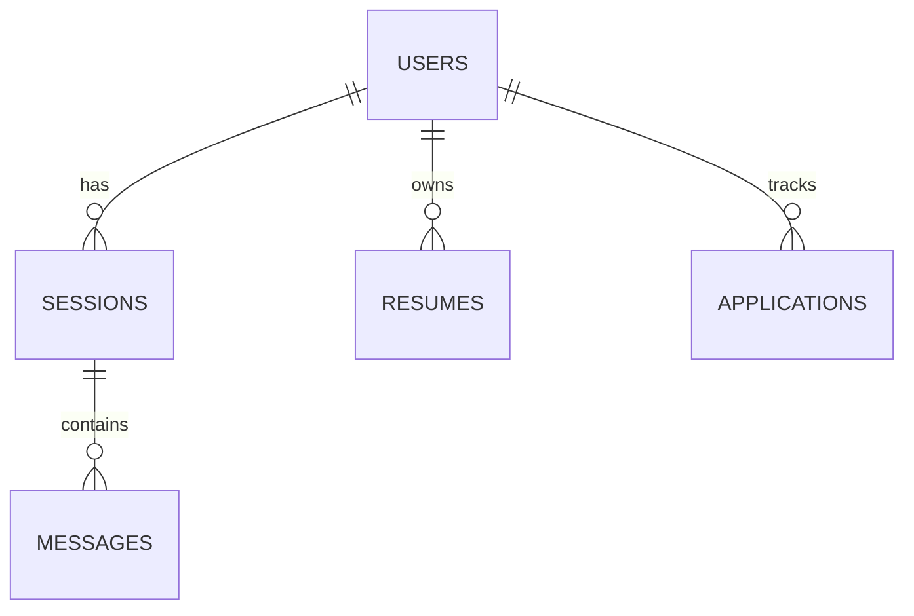

## SQLite Tables

| Table           | Purpose          |
| --------------- | ---------------- |
| Users           | User information |
| Sessions        | Chat sessions    |
| Messages        | Chat history     |
| Resume Profiles | Resume metadata  |
| Applications    | Job tracker      |

---

## Chroma Collections

| Collection | Purpose            |
| ---------- | ------------------ |
| Resume     | Resume embeddings  |
| Memory     | Long-term facts    |
| Documents  | Uploaded documents |

# 12. Deployment Architecture

JobHuntAI is split into independent services.

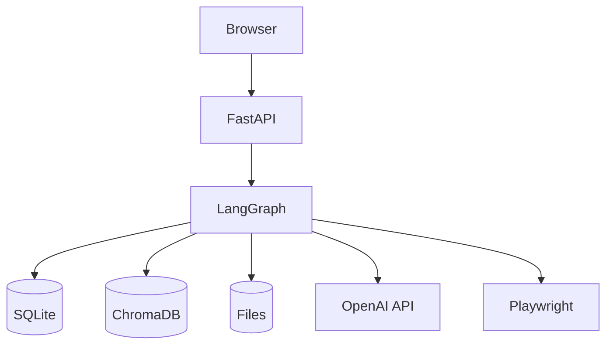

## Services

| Service      | Responsibility     |
| ------------ | ------------------ |
| Frontend     | User interface     |
| FastAPI      | API server         |
| LangGraph    | AI workflows       |
| SQLite       | Structured data    |
| ChromaDB     | Semantic search    |
| File Storage | Resume files       |
| GPT-4o       | LLM                |
| Playwright   | Browser automation |
# 13. Observability

Every workflow is traced using LangSmith.

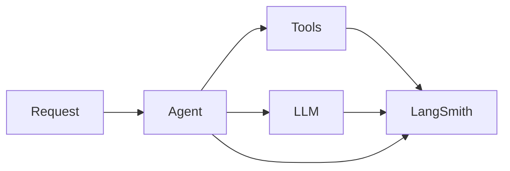

## Captured Data

* LLM calls
* Tool execution
* Latency
* Token usage
* Errors
* User feedback

This helps debug workflows and improve agent performance.
# 14. Project Structure

```text
backend/
│
├── api/
│   ├── chat.py
│   ├── resume.py
│   ├── applications.py
│   └── sessions.py
│
├── agent/
│   ├── graph.py
│   ├── memory.py
│   └── tools/
│       ├── job_search.py
│       ├── resume_tailor.py
│       ├── company_research.py
│       ├── auto_apply.py
│       └── rag.py
│
├── db/
│   ├── sqlite.py
│   └── chroma.py
│
├── resume/
│   ├── ingestion.py
│   ├── tailoring.py
│   └── pdf_generator.py
│
├── playwright/
│   ├── ats_detector.py
│   └── form_filler.py
│
└── observability/
    └── langsmith.py
```

---

## Module Responsibilities

| Module           | Responsibility          |
| ---------------- | ----------------------- |
| `api/`           | REST & SSE endpoints    |
| `agent/`         | LangGraph orchestration |
| `tools/`         | AI tools                |
| `db/`            | Database access         |
| `resume/`        | Resume processing       |
| `playwright/`    | Browser automation      |
| `observability/` | Tracing and monitoring  |
